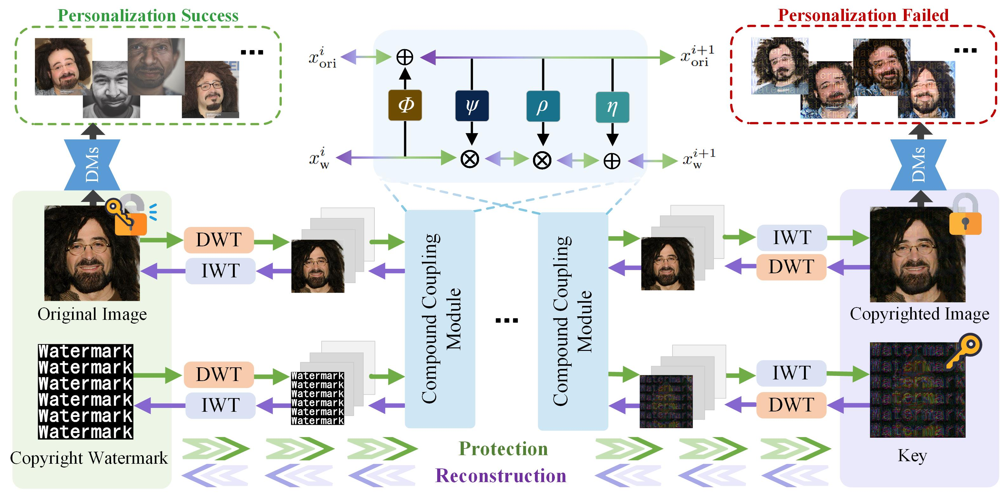

# Invertible-Networks-for-Copyright-Protection-in-Text-to-Image-Synthesis

## Abstract
To defend against personalized generation, a new form of infringement that is more concealed and destructive, the existing copyright protection methods is to add adversarial perturbations in images. However, these methods focus solely on countering illegal personalization, neglecting the requirement for legitimate personalization. Moreover, none of these methods are capable of directly verifying and tracing the copyright from adversarial examples. In response to these limitations, we propose a traceable and authorizable copyright traceability method that embeds the copyright watermark into images through a series of invertible compound coupling modules. 
We introduce a novel information exchange mechanism for invertible neural network and design a contrastive learning-based optimization strategy tailored to address personalized infringement issues.
\textbf{Our method effectively mitigates the malicious use of unauthorized personalized generation models} by inducing watermark-like artifacts and obscuring privacy details in generated images. \textbf{Additionally, it facilitates copyright traceability and supports authorized legitimate personalization, thereby offering broader practical applicability.} Experimental results demonstrate that our method can almost losslessly restore original image and extract copyright watermark, achieving FID exceeding 300 and causing visually noticeable artifacts in unauthorized personalized images. Furthermore, it exhibits consistent robustness against adversarial purification and text prompt modifications.

<p align="center">
  
</p>

## Method
<p align="center">
  
</p>

## Environment Setup
This project provides both `environment.yml` (Conda) and `requirements.txt` (pip).

### Option 1: Conda (recommended)
```bash
conda env create -f environment.yml
conda activate ldm_db
```

### Option 2: pip
```bash
pip install -r requirements.txt
```

## Dataset Preparation
Place your original images and watermark file in the following structure:
```
data/ 
│
├── Original/                  # Original images to be protected
└── watermark.png              # Copyright watermark
```

## Training
```bash
bash scripts/train.sh
```
## Training Demo
``` python
python train.py \
    --inputpath_all "./data/VGGFace2_demo"\
    --copyrightpath "./data/copyright.png" \
    --T2Imodel "stabilityai/stable-diffusion-2-1"
```

## License
[MIT License:](https://github.com/LiAutoAD/LightVLA/blob/main/LICENSE)

## Acknowledgements
This codebase incorporates components adapted from [Hinet](https://github.com/TomTomTommi/HiNet) project. 

## BibTeX
```bibtex
@inproceedings{hu2025controls,
  title={Who Controls the Authorization? Invertible Networks for Copyright Protection in Text-to-Image Synthesis},
  author={Hu, Baoyue and Wei, Yang and Xiao, Junhao and Huang, Wendong and Bi, Xiuli and Xiao, Bin},
  booktitle={Proceedings of the IEEE/CVF International Conference on Computer Vision},
  pages={15832--15841},
  year={2025}
}
```
